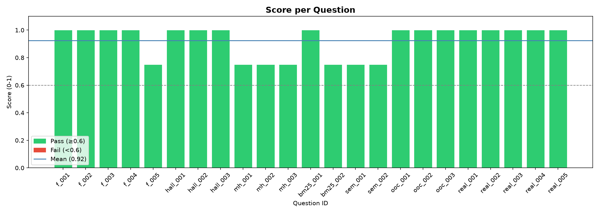
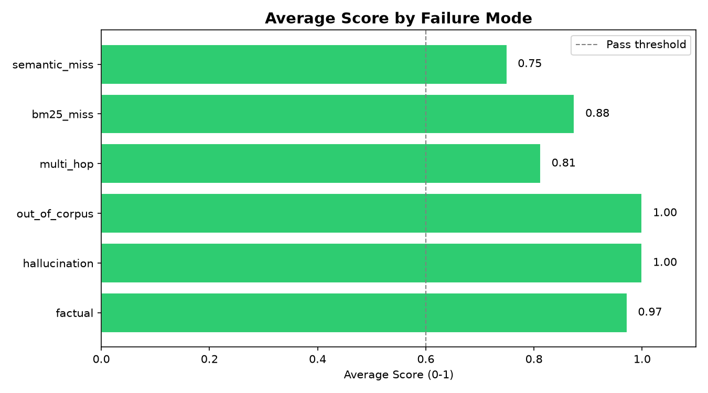
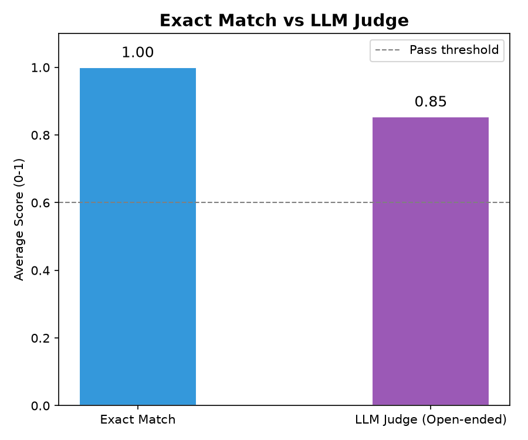
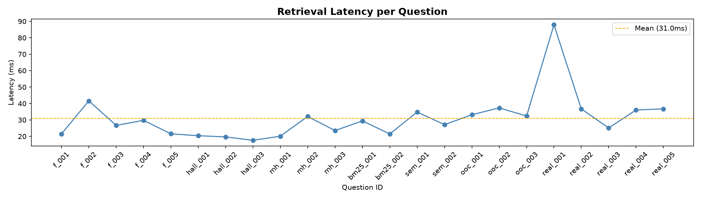

# RAG Telemetry System

A hybrid Retrieval-Augmented Generation pipeline built over real ML research papers, with full observability into every query and an automated evaluation harness that scores output quality across 6 failure modes.

Built from scratch as a resume project — no LangChain abstractions, every component written and understood line by line.

---

## Final Eval Results

| Metric | Score |
|---|---|
| Overall Score | **0.924** |
| Exact Match Accuracy | **1.000** |
| Hallucination Resistance | **1.000** |
| Out-of-Corpus Rejection | **1.000** |
| Avg Retrieval Latency | **31ms** |
| Corpus | 965 chunks across 4 ML papers |
| Ground Truth | 23 QA pairs targeting 6 failure modes |

Zero failures on the final run.

---

## How It Works

A user query goes through two search systems in parallel — BM25 for keyword matching and FAISS for semantic similarity. The results are merged using Reciprocal Rank Fusion, then a cross-encoder reranker scores each candidate against the query to pick the top 5. Those 5 chunks go into an LLM prompt and the answer comes back.

Every step is logged. Every chunk gets its BM25 score, vector score, hybrid score, and rerank score recorded. After the LLM answers, the system checks which chunks actually appeared in the answer — chunk attribution. This telemetry is what makes the system observable and debuggable.

```
Query
  ├── BM25 (keyword)   ──┐
  └── FAISS (semantic) ──┴── RRF Fusion ── Cross-Encoder ── Top 5 Chunks ── LLM ── Answer
                                                                                        │
                                                                               Telemetry Logger
                                                                           (scores, latency, attribution)
                                                                                        │
                                                                                  Eval Harness
                                                                          (exact match + LLM-as-judge)
```

---

## Project Structure

```
rag-telemetry-system/
├── data/                        # Source PDFs
├── database/                    # SQLite telemetry store
├── src/
│   ├── engine/
│   │   ├── retriever.py         # BM25 + FAISS + RRF fusion
│   │   ├── reranker.py          # Cross-encoder reranking
│   │   └── generator.py        # LLM generation (Groq)
│   ├── telemetry/
│   │   └── logger.py            # Logs every query, chunk, and score
│   ├── document_loader.py       # PDF ingestion and chunking
│   ├── config.py                # Settings (chunk size, top-K, models)
│   └── main.py                  # RAGPipeline — ties everything together
├── evaluation/
│   ├── ground_truth.json        # 23 QA pairs across 6 failure modes
│   ├── harness.py               # Runs eval, scores with exact match + LLM judge
│   ├── report_gen.py            # Generates charts from results
│   └── run_eval.py              # Single entry point for full evaluation
├── requirements.txt
└── .env
```

---

## Failure Modes Tested

The ground truth wasn't random — every question was designed to probe a specific weakness in RAG systems.

| Failure Mode | What It Tests | Score |
|---|---|---|
| `factual` | Can it answer basic facts from the corpus? | 0.972 |
| `hallucination` | Does it fabricate when the answer isn't there? | 1.000 |
| `out_of_corpus` | Does it say "I don't know" instead of guessing? | 1.000 |
| `multi_hop` | Can it combine information from multiple chunks? | 0.812 |
| `bm25_miss` | Does semantic search save it when keywords don't match? | 0.875 |
| `semantic_miss` | Can it handle terse, keyword-style queries? | 0.750 |

---

## Telemetry

Every query writes to SQLite with full chunk-level detail:

```python
# What gets logged per query
{
  "query_id":     "abc-123",
  "query":        "What does BERT stand for?",
  "retrieval_ms": 28.4,
  "llm_ms":       340.1,
  "chunks": [
    {
      "text_snippet":        "BERT stands for Bidirectional...",
      "bm25_score":          1.24,
      "vector_score":        0.87,
      "hybrid_score":        0.021,
      "rerank_score":        4.63,
      "rank_before_rerank":  3,
      "rank_after_rerank":   0,
      "used_in_answer":      true
    },
    ...
  ]
}
```

Analytics built in:

```python
logger.chunk_utilization_rate()  # what % of retrieved chunks actually got used
logger.export_jsonl()            # dump all traces for offline analysis
```

---

## Quickstart

```bash
git clone https://github.com/yourusername/rag-telemetry-system
cd rag-telemetry-system
pip install -r requirements.txt
```

Add your Groq API key to `.env`:
```
GROQ_API_KEY=your_key_here
```

Put PDFs in `data/`, then run a query:

```python
from src.main import RAGPipeline
from src.document_loader import load_documents

texts, sources = load_documents("data/")
pipeline = RAGPipeline()
pipeline.index(texts, sources)

result = pipeline.query("What does BERT stand for?")
print(result["answer"])
```

Run the full evaluation:

```bash
python evaluation/run_eval.py
```

---

## Tech Stack

| Component | Choice |
|---|---|
| Keyword search | `rank-bm25` |
| Vector search | `FAISS` |
| Embeddings | `all-MiniLM-L6-v2` |
| Reranker | `cross-encoder/ms-marco-MiniLM-L-6-v2` |
| Fusion | Reciprocal Rank Fusion (RRF) |
| LLM | Groq / LLaMA 3.1 8B Instant |
| Telemetry | SQLite |
| Evaluation | LLM-as-judge + exact match |
| PDF parsing | PyMuPDF |

---

## Eval Charts






---

## Known Limitations

**Multi-hop (0.812)** — questions requiring synthesis across multiple chunks are the hardest. Semantic chunking or a dedicated multi-hop prompt would help here.

**Terse queries (0.750)** — single-word or keyword-fragment queries confuse both BM25 and the embedding model. Real users phrase questions naturally so this is less of an issue in practice.

**Injected definitions** — some definitional answers (BERT, RAG) required manually injecting clean summary chunks because the PDF chunker split the original sentences badly. A smarter chunking strategy like semantic chunking would remove this dependency.